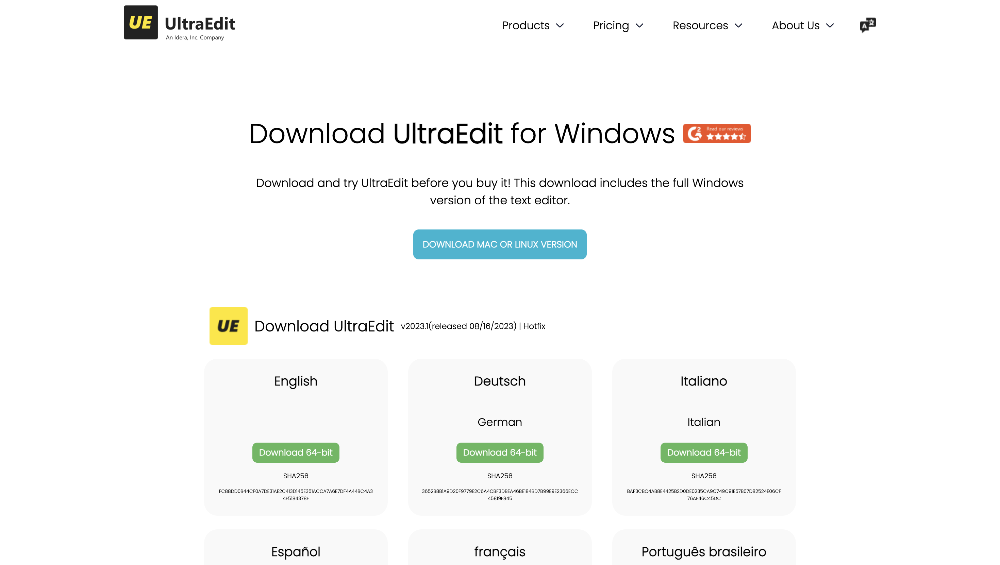
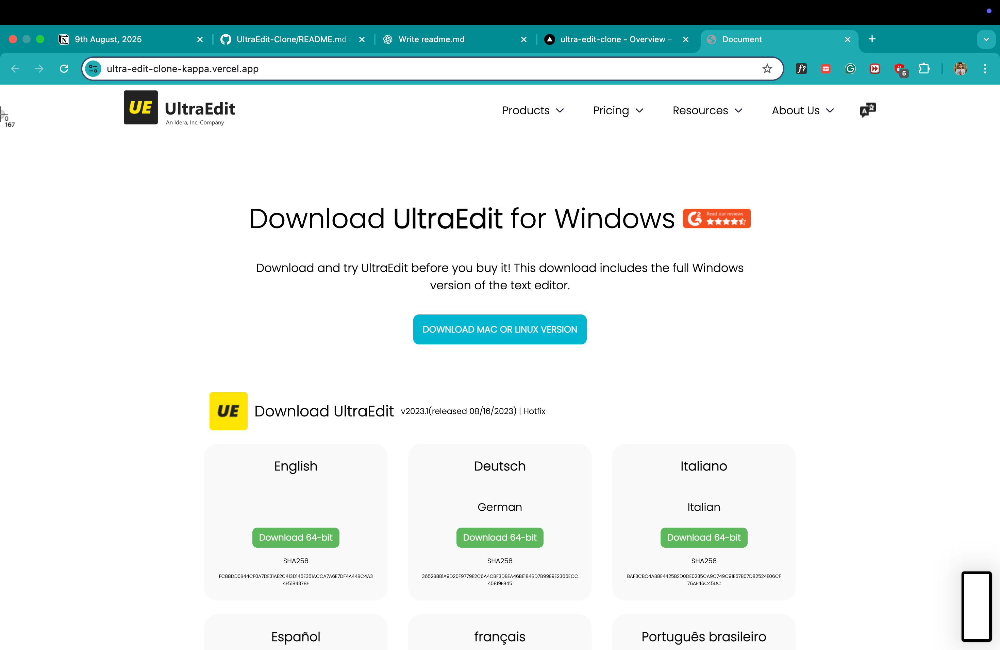

# 🌐 UltraEdit Download Page Clone  

[]()  
[]()  
[]()  

A **modern, responsive** clone of the UltraEdit download page built with pure **HTML** & **CSS**.  
This project mimics the real UltraEdit design with attention to detail in **layout, typography, and interactivity**.  

---

## ✨ Features  

- 📱 **Responsive Design** — Works perfectly on desktop and adapts for smaller screens with media queries.  
- 🎯 **Pixel-Perfect Layout** — Header navigation, download cards, and section alignment just like the original.  
- 🖼 **Optimized Images** — Used official UltraEdit assets to make it realistic.  
- 🎨 **Custom Styling** — CSS hover effects, button styling, and box layouts.  
- 🧩 **Grid System** — Download cards displayed using CSS Grid for clean structure.  
- 🎭 **Flexbox Magic** — Used in the header and main sections for alignment.  

---

## 🛠️ Tech Stack  

- **HTML5** — Semantic and well-structured markup.  
- **CSS3** — Custom styles, Flexbox, Grid, hover effects, and responsive design.  
- **Google Fonts** — `Poppins` font for a clean and modern look.  

---

## 📸 Screenshots  

> *(Replace these placeholders with your own screenshots)*  

  
  

---

## 🚀 Getting Started  

1. **Clone the repository**  
   ```bash
   git clone https://github.com/your-username/ultraedit-clone.git
   ## 🚀 Open the HTML file
Just open `index.html` in your browser — no server required!  

---

## 📚 Concepts Used
- HTML5 semantic structure  
- CSS Flexbox & Grid  
- Responsive design with media queries  
- Hover & active state styling  
- External fonts from Google Fonts  
- Linking external images & assets  

---

## 💡 Ideas for Improvement
- Add dark mode toggle 🌙  
- Implement dropdown menus with JavaScript  
- Make download links functional with real files  

---

## 🌍 Live Demo
🔗 [**View Live Project**](https://your-live-demo-link.com)  

---

## ⭐ Support
If you **liked** this project, please consider giving it a **star** ⭐ — it really motivates me to build more awesome projects!  

---

Made with ❤️ by [Your Name]
